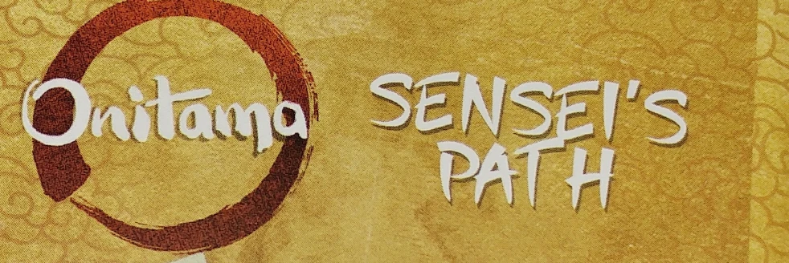

# 
 ⛩️  ONITAMA ⛩️ 
 

# 
### 
Bienvenue dans l'univers de Onitama en plein cœur de l'ère edo au pays du soleil levant.Vous incarnez ici un fin stratège à la tête d'un groupe de 4 samouraïs dont le but est de défaire le seigneur de la faction ennemie qui dispose des mêmes forces que vous, tout en protégeant le vôtre au prix de votre vie ! A vous de placer vos troupes afin de parvenir à vos fins et de devenir le maître incontesté d'Onitama.
 

# 🎥 Vidéo de présentation

https://opencast.dsi.uca.fr/paella/ui/watch.html?id=b22d45e3-b440-4367-b3bf-4affd74019c0

# 📋 Liens 

* Doc des règles : https://docs.google.com/document/d/115G7TmYWNAShILOuHSxuAIGiHK2s4nkqKa04eawksAk/edit?usp=sharing
* Présentation du jeu : https://docs.google.com/document/d/1qztzfd2T5jlFW8ySPfJmR7WcDZEF2Mn6c0Kqz0xAQgM/edit?usp=sharing
* Liens des sketchs : https://balsamiq.cloud/swktnva/pv8ooo2/r49F2
* Liens des storyboards : https://app.diagrams.net/#G1tBs1Gn40dHvr9ECmEKMrM5CPnl7u2C8_#%7B%22pageId%22%3A%22NZNHjV_waxoiX9BEoEoE%22%7D

* lien vers persona: https://ucafr-my.sharepoint.com/:p:/g/personal/alban_tixier_etu_uca_fr/EajrqBdAPhpIq_fXoIrhZ24BLPhm1yoGnBd_zSkac_drng?e=9Rtb7S

# 🎮 Comment jouer : 
     
**Executez la commande :**

 dotnet publish -f net9.0-windows10.0.19041.0 -c Release -r win-x64 --self-contained true -p:PublishSingleFile=true -p:PublishTrimmed=false -p:UseMonoRuntime=false -p:WindowsPackageType=None 
 

### Remarque : La branche boardscardbinding était un essai pour afficher les coups disponibles des cartes à partir d'un board, par manque de temps la branche n'a pas pu être terminée mais pourra à l'avenir être ajoutée